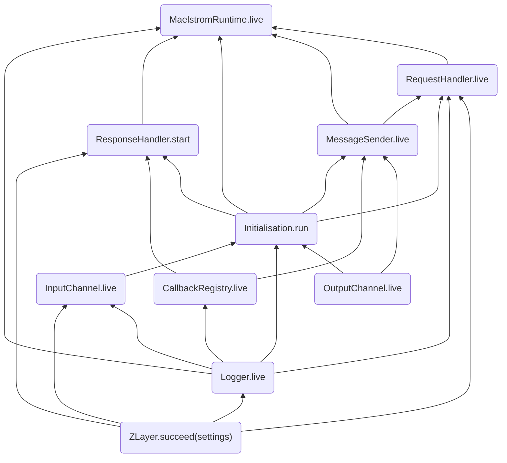

### Principles

zio-maelstrom is implemented as a driver library and does not try become a framework. Its because the whole point of it is to learn and have fun. Frameworks are alright but they box you and restrict what you can do in order to make you faster. With opinionated frameworks, you learn less and there is less scope for creativity and exploration.

I have tried to keep things as simple as possible on the interface level. The library follows ZIO idiomatic practices and is functional in nature. 

**What does this library do?**

- [x] Abstracts STDIN and STDOUT and exposes a simple Network IO interface to send and receive messages
- [x] Handles `Init` message
- [x] Calls your message handlers concurrently when messages arrive
- [x] RPC messages - maintains correlation between requests and responses
- [x] Gives you traits - `Sendable`, `Reply` and `NeedsResponse` to help you define your own protocol

**What it doesn't do**

- [ ] Define messaging protocols
- [ ] Define message handlers
- [ ] Handle errors and timeouts
- [ ] Maintain node state

These are the things you need to do. Because you are using `ZIO`, you get super powers to deal with concurrency, domain errors, timeout errors, state management, retries and more. The possibilities are endless with `ZIO` ecosystem and primitives such as `Ref`, `Promise`, `Queue`, `STM` etc.

### Design

### The runtime

The runtime is implemented as `ZLayer`s. Because `ZLayer` allows creation from a `ZIO` effect, it is possible to run effects before message handlers are invoked

This is more evident if we look at the definition of type `MaelstromRuntime` and its layer construction

```scala title="MaelstromRuntime"
type MaelstromRuntime = Initialisation & MessageSender & Logger & Settings
```

<!--codeinclude-->
[Layer construction](../../zio-maelstrom/src/main/scala/com/bilal-fazlani/zio-maelstrom/MaelstromRuntime.scala) block:live
<!--/codeinclude-->

Using effects to create layers makes these effects run before user's effect. In this case initialization and starting of response handler is done as part of layer creation

!!! note
    Initialization refers to the handling of `init` message



### Reading STDIN

Reading STDIN is done using a `ZStream` and then each line is parsed into a `GenericMessage`. `GenericMessage` is a semi parsed messaged that is used to determine the `type` of message, whether it is a reply to some other message, etc.

The first element of this stream is assumed to be `init` message because that is guaranteed by maelstrom. First element is consumed from the stream and then the remaining stream is split into two streams - one for the normal messages and one for the replies. This is done using `ZStream#partition` method. The partitioning is done using the `in_reply_to` field of the message. If this field is set, the message is identified as reply.

 
 

These two streams are subscribed by two different consumers. Message stream is consumed by the `receive` api (invoked by the user). Reply stream is consumed by the `ResponseHandler` which is invoked during creation of  `MaelstromRuntime` layer.

### Request-Response pattern

The `ask` api lets users send a message and also wait for a reply. It uses `Promise` to achieve this. When a message is sent, a `Promise` is created and stored in the `CallbackRegistry` layer in a map against a `CallbackId`. A callbackId is a combination of `msg_id` and `dest` of the message. When a reply is received, the `CallbackRegistry` layer completes the promise with the reply message.

Every message that needs a reply needs to have a `msg_id` field and all the reply messages need to have `in_reply_to` field set to the `msg_id` of the original message. This is how reply messages are correlated to the original message.

The `ask` api is resource-safe. Meaning if an `ask` operation is interrupted, the callback (promise) is removed the registry. Promises are also removed in the event of a timeout and when a reply is received. This is done using ZIO's Scope and its Finalizer.